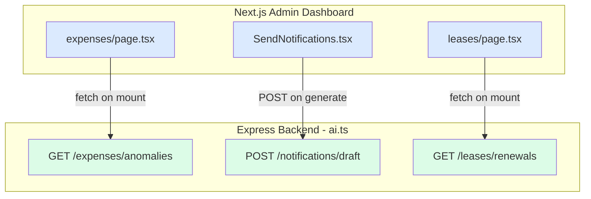

# Design Document — AI Intelligence Overhaul

## Overview

The AI Intelligence Overhaul surfaces already-implemented backend AI capabilities into the admin dashboard UI and repairs three correctness bugs in the backend logic. The backend (`aiService.ts`, `ai.ts`) and mobile chatbot (`chatbot.tsx`, `profilebot.tsx`) are fully implemented. The remaining work is:

1. **Three frontend UI additions** — AI Financial Audit Alerts feed on the expenses page, AI Writing Assistant panel inside `SendNotifications.tsx`, and AI Renewal Assistant panel on the leases page.
2. **Three backend bug fixes** — anomaly detection uses a 60-day window instead of 90 days, the lease renewal query starts at day 50 instead of day 60, and the notification drafting endpoint has no JSON schema validation guard on the LLM response.

No new endpoints, no new database tables, no new service files are required. All changes are surgical.

---

## Architecture

The system follows the existing three-tier pattern:

```
Mobile App (React Native/Expo)
        │
        └──► Backend API (Express/TypeScript)
                 │  POST /api/ai/chat
                 │  GET  /api/ai/pricing/recommend
                 │  GET  /api/ai/risk-score/:id
                 │  GET  /api/ai/expenses/anomalies
                 │  POST /api/ai/notifications/draft
                 │  GET  /api/ai/leases/renewals
                 │
Admin Dashboard (Next.js)
        │
        └──► Backend API (same endpoints above)
```

All six AI routes already exist and are mounted at `/api/ai` in `index.ts`. The frontend additions are pure consumers — they call the existing endpoints and render the responses. The backend bug fixes are in-place corrections to `ai.ts` with no interface changes.



---

## Components and Interfaces

### Frontend Components

#### 1. `AiAnomalyFeed` (inline in `expenses/page.tsx`)

Positioned below the existing metrics row and filter section. No external component file needed — rendered inline in the page JSX.

**Props / State:**
| Name | Type | Purpose |
|---|---|---|
| `anomalies` | `AnomalyAlert[]` | Fetched from `/api/ai/expenses/anomalies` |
| `anomalyLoading` | `boolean` | Controls skeleton / spinner display |
| `anomalyError` | `string \| null` | Controls error banner display |

**AnomalyAlert shape** (from existing backend response):
```ts
interface AnomalyAlert {
  id: string;
  propertyId: number;
  propertyTitle: string;
  severity: "CRITICAL" | "WARNING";
  message: string;
  confidenceScore: number;
}
```

Alerts are sorted client-side: `CRITICAL` first, then `WARNING`. Up to 50 are displayed.

---

#### 2. `AiWritingAssistant` (collapsible panel inside `SendNotifications.tsx`)

Rendered inside the Compose Message column, above the Title and Message fields. The panel toggles open/closed via a chevron button. When collapsed, only the header row is visible.

**Local state additions to `SendNotificationForm`:**
| Name | Type | Purpose |
|---|---|---|
| `aiPanelOpen` | `boolean` | Collapsed / expanded toggle |
| `aiTemplateType` | `string` | Selected template type |
| `aiContext` | `string` | Free-text context (max 500 chars) |
| `aiGenerating` | `boolean` | Disables generate button while loading |
| `aiError` | `string \| null` | Inline error inside the panel |

**Template options:** `"Rent Increase"`, `"Maintenance Outage"`, `"Survey"` (minimum — more can be added).

On successful generation, calls `setTitle(draft.title)` and `setMessage(draft.message)` — the parent form's existing state setters.

---

#### 3. `AiRenewalPanel` (inline in `leases/page.tsx`)

Positioned above the `DynamicTable`. Fetches `/api/ai/leases/renewals` on mount.

**Local state:**
| Name | Type | Purpose |
|---|---|---|
| `renewals` | `RenewalRecord[]` | Fetched list |
| `renewalLoading` | `boolean` | Loading indicator |
| `renewalError` | `string \| null` | Error state |

**RenewalRecord shape** (from existing backend response):
```ts
interface RenewalRecord {
  leaseId: number;
  propertyId: number;
  propertyTitle: string;
  tenantId: number;
  tenantName: string;
  endDate: string;
  tenureMonths: number;
  riskScore: number;
  riskCategory: "Low" | "Medium" | "High";
  isFlightRisk: boolean;
  incentive: string;
}
```

**Badge color function:**
```ts
function renewalBadgeColor(isFlightRisk: boolean, riskCategory: string): string {
  if (isFlightRisk) return "amber";
  if (riskCategory === "High") return "red";
  return "green";
}
```

Quick-action button navigates to `/messages/send?tenant={tenantName}&template=Lease+Renewal`.

---

### Backend Bug Fixes

#### Bug Fix 1 — Anomaly Detection: 60-day → 90-day window (`ai.ts`, line ~161)

**Current (broken):**
```ts
const cutOff = new Date();
cutOff.setDate(cutOff.getDate() - 60);
```

**Fixed:**
```ts
const cutOff = new Date();
cutOff.setDate(cutOff.getDate() - 90);
```

The rolling average baseline must also use only 90-day records. Currently, all grouped records are used for mean/stddev. The fix separates the baseline computation to use only the 90-day window records, then checks recent (also within 90 days) spikes against that baseline.

**Corrected logic:**
```ts
// Use only records within the 90-day window for the baseline
const cutOff = new Date();
cutOff.setDate(cutOff.getDate() - 90);

const windowRecords = list.filter(e => new Date(e.date) >= cutOff);
if (windowRecords.length < 3) continue;

const amounts = windowRecords.map(l => l.amount);
const mean = amounts.reduce((sum, a) => sum + a, 0) / amounts.length;
const variance = amounts.reduce((sum, a) => sum + Math.pow(a - mean, 2), 0) / amounts.length;
const stdDev = Math.sqrt(variance);

if (stdDev === 0) continue;

for (const exp of windowRecords) {
  if (exp.amount > mean + 2 * stdDev) {
    // ... emit anomaly
  }
}
```

Note: the `list.length < 3` guard also moves to check `windowRecords.length < 3` so the minimum-records threshold is evaluated against the 90-day window, not all-time records.

---

#### Bug Fix 2 — Lease Renewal Window: day 50/100 → day 60/90 (`ai.ts`, line ~242)

**Current (broken):**
```ts
const minEnd = new Date();
minEnd.setDate(today.getDate() + 50);
const maxEnd = new Date();
maxEnd.setDate(today.getDate() + 100);
```

**Fixed:**
```ts
const minEnd = new Date();
minEnd.setDate(today.getDate() + 60);
const maxEnd = new Date();
maxEnd.setDate(today.getDate() + 90);
```

---

#### Bug Fix 3 — Notification Draft: Missing JSON schema validation (`ai.ts`, notification draft handler)

**Current (broken):** The LLM response is cleaned of markdown fences and passed directly to `JSON.parse`. If parsing succeeds but the object is missing `title` or `message`, or those fields are empty strings, the invalid draft is returned to the client.

**Fixed:** After `JSON.parse`, validate that both fields exist and are non-empty strings before returning:

```ts
const aiResponse = await callLLM(systemPrompt, 'Draft property notification.');
const cleanedJson = aiResponse.replace(/```json/g, '').replace(/```/g, '').trim();
const parsed = JSON.parse(cleanedJson);

if (
  typeof parsed.title === 'string' && parsed.title.trim().length > 0 &&
  typeof parsed.message === 'string' && parsed.message.trim().length > 0
) {
  draft = parsed;
} else {
  throw new Error('LLM response missing required title or message fields');
}
```

If this validation throws (either `JSON.parse` fails or the field check fails), the `catch` block falls through to the existing local template fallback.

---

## Data Models

No schema changes. All data models are pre-existing in Prisma. The relevant shapes used by the new UI widgets are documented under Components and Interfaces above.

For reference, the Prisma models accessed by the three AI endpoints are:

| Endpoint | Prisma models read |
|---|---|
| `/api/ai/expenses/anomalies` | `Expense`, `Property` |
| `/api/ai/notifications/draft` | none (pure LLM call) |
| `/api/ai/leases/renewals` | `Lease`, `Property`, `LeaseTenant`, `User`, `RentSchedule`, `Payment`, `Review` |

---

## Correctness Properties

*A property is a characteristic or behavior that should hold true across all valid executions of a system — essentially, a formal statement about what the system should do. Properties serve as the bridge between human-readable specifications and machine-verifiable correctness guarantees.*

---

### Property 1: Anomaly detection uses only the 90-day window

*For any* set of expense records for a given property-category pair, the anomaly detector SHALL include in its baseline mean and standard deviation computation only records dated within the past 90 days; any record dated more than 90 days ago SHALL be excluded from the computation and SHALL NOT influence whether any expense is flagged as a spike.

**Validates: Requirements 6.2**

---

### Property 2: Minimum record count guard

*For any* property-category pair whose expenses within the 90-day window number fewer than 3, the anomaly detector SHALL emit zero anomaly records for that pair, regardless of the amounts present.

**Validates: Requirements 6.3**

---

### Property 3: Spike severity classification is determined by standard deviation multiple

*For any* property-category pair with a computed 90-day mean and standard deviation where stdDev > 0, and for any expense amount in that window that exceeds mean + 2 × stdDev: the anomaly record's severity SHALL be "CRITICAL" if the amount exceeds mean + 3 × stdDev, and "WARNING" otherwise.

**Validates: Requirements 6.4**

---

### Property 4: Duplicate invoice detection fires on matching criteria with correct vendor priority

*For any* pair of expenses, the duplicate invoice detector SHALL flag them if and only if all of the following hold: same `propertyId`, same `amount`, same `category`, date difference ≤ 7 days, and at least one vendor identifier is present. When `vendorAccountId` is non-null on both expenses, the match SHALL be evaluated on `vendorAccountId`; when `vendorAccountId` is null, the match SHALL fall back to `vendorName`. If neither expense has any vendor identifier (both `vendorName` and `vendorAccountId` are null), the pair SHALL NOT be flagged.

**Validates: Requirements 6.5, 6.6**

---

### Property 5: Notification draft validation gate

*For any* string returned by the LLM for the notification draft endpoint, the system SHALL only forward the parsed JSON to the client when the parsed object contains both a `title` field and a `message` field that are non-empty strings; for any other response (invalid JSON, missing fields, empty strings), the system SHALL apply the local template fallback and SHALL NOT return the malformed LLM content to the client.

**Validates: Requirements 9.3**

---

### Property 6: Lease renewal window uses inclusive 60–90 day bounds

*For any* set of leases with arbitrary end dates, the renewals endpoint SHALL include a lease in its response if and only if the lease's `endDate` is at least 60 days from today (UTC) and at most 90 days from today (UTC); leases whose `endDate` is 59 days or fewer from today, or 91 days or more, SHALL NOT appear in the response.

**Validates: Requirements 10.1**

---

### Property 7: Anomaly sort order — CRITICAL precedes WARNING

*For any* list of anomaly alert objects with mixed "CRITICAL" and "WARNING" severities, after sorting, every "CRITICAL" item SHALL appear at an index lower than every "WARNING" item.

**Validates: Requirements 7.2**

---

### Property 8: AI Writing Assistant generate button state

*For any* combination of `templateType` (string or empty) and `aiContext` (string), the generate button SHALL be disabled if `templateType` is falsy or `aiContext` trimmed is empty; the generate button SHALL be enabled only when both `templateType` is a non-empty string and `aiContext` trimmed is non-empty.

**Validates: Requirements 8.4**

---

### Property 9: Renewal badge color follows precedence rule

*For any* renewal record with an `isFlightRisk` boolean and a `riskCategory` of "Low", "Medium", or "High", the badge color function SHALL return amber when `isFlightRisk` is true, red when `isFlightRisk` is false and `riskCategory` is "High", and green in all other cases.

**Validates: Requirements 11.3**

---

## Error Handling

### Frontend

| Scenario | Behavior |
|---|---|
| `/api/ai/expenses/anomalies` fails | Widget shows error message; metrics, filters, and expense table above remain visible and interactive |
| `/api/ai/expenses/anomalies` returns empty array | Widget shows "No anomalies detected" positive confirmation |
| `/api/ai/notifications/draft` fails | Inline error inside the AI Writing Assistant panel; compose form fields unchanged |
| `/api/ai/leases/renewals` fails | Renewal panel shows error message; lease table below remains visible |
| `/api/ai/leases/renewals` returns empty array | Panel shows "No renewals due in the next 60–90 days" |

### Backend (bug fixes)

The three bug fixes do not change error handling behavior. Bug Fix 3 (notification draft validation) adds a throw path inside the try block, which routes to the already-present catch block that falls back to local templates — no new error surface to the client.

---

## Testing Strategy

### Unit Tests (example-based)

Focus on specific scenarios and edge conditions:

- **AiAnomalyFeed** — renders loading skeleton, renders empty state, renders error state, renders list of mixed alerts with CRITICAL first.
- **AiWritingAssistant** — generate button disabled when context empty, disabled when template not selected, enabled when both filled, POST called with correct body, form fields updated on success, inline error on failure.
- **AiRenewalPanel** — renders loading, renders empty state, renders error, renders records with correct fields, quick-action button navigates correctly.
- **Badge precedence** — verify `renewalBadgeColor(true, "Low")` = amber, `renewalBadgeColor(false, "High")` = red, `renewalBadgeColor(false, "Medium")` = green.
- **Backend bug fixes** — unit test the anomaly detection function with a known dataset where records span 45, 70, and 100 days ago; verify only the 70-day record contributes to the baseline and the 100-day record is ignored. Unit test the lease renewal date filter with leases at day 59, 60, 90, and 91; verify only 60 and 90 are returned. Unit test the JSON validation guard with missing-field objects and empty-string fields; verify fallback is returned.

### Property-Based Tests

Uses **fast-check** (already available in the TypeScript ecosystem, zero additional setup) with minimum 100 iterations per property.

Each test is tagged with `// Feature: ai-intelligence-overhaul, Property N: <property_text>`.

| Property | Test approach |
|---|---|
| P1 (90-day window) | Generate expense sets with records at random days (1–120 ago). Compute expected baseline using only ≤90-day records. Verify detector output matches. |
| P2 (minimum record count) | Generate property-category pairs with 0, 1, or 2 records randomly placed in the 90-day window. Verify zero anomalies emitted. |
| P3 (severity classification) | Generate (mean, stdDev, amount) triples with amount > mean + 2×stdDev. Compute expected severity. Verify detector assigns same severity. |
| P4 (duplicate detection + vendor priority) | Generate expense pairs with random (propertyId, amount, category, date, vendorAccountId, vendorName) fields. Compute expected flag. Verify detector matches. |
| P5 (notification draft validation) | Generate random strings and partial objects. Verify output is always the fallback template unless both fields are non-empty strings. |
| P6 (lease renewal window) | Generate lease sets with random endDates. Verify returned list = leases where endDate in [today+60, today+90]. |
| P7 (anomaly sort order) | Generate random arrays of anomaly objects with mixed severities. Sort. Verify all CRITICAL precede all WARNING. |
| P8 (generate button state) | Generate random (templateType, aiContext) strings including empty/whitespace variants. Verify disabled iff templateType falsy or aiContext.trim() empty. |
| P9 (badge precedence) | Generate random (isFlightRisk: boolean, riskCategory: enum) combinations. Verify badge color matches rule. |

**Configuration:**
```ts
import fc from "fast-check";
fc.configureGlobal({ numRuns: 100 });
```

### Integration Tests

- Verify the anomaly endpoint returns HTTP 200 against a seeded test database with known expense records.
- Verify the renewal endpoint returns HTTP 200 with the corrected 60-day lower bound.
- Verify the draft endpoint returns HTTP 400 when `templateType` or `landlordInput` is absent.
- Verify all `/api/ai/*` endpoints return HTTP 401 without a valid auth token.
