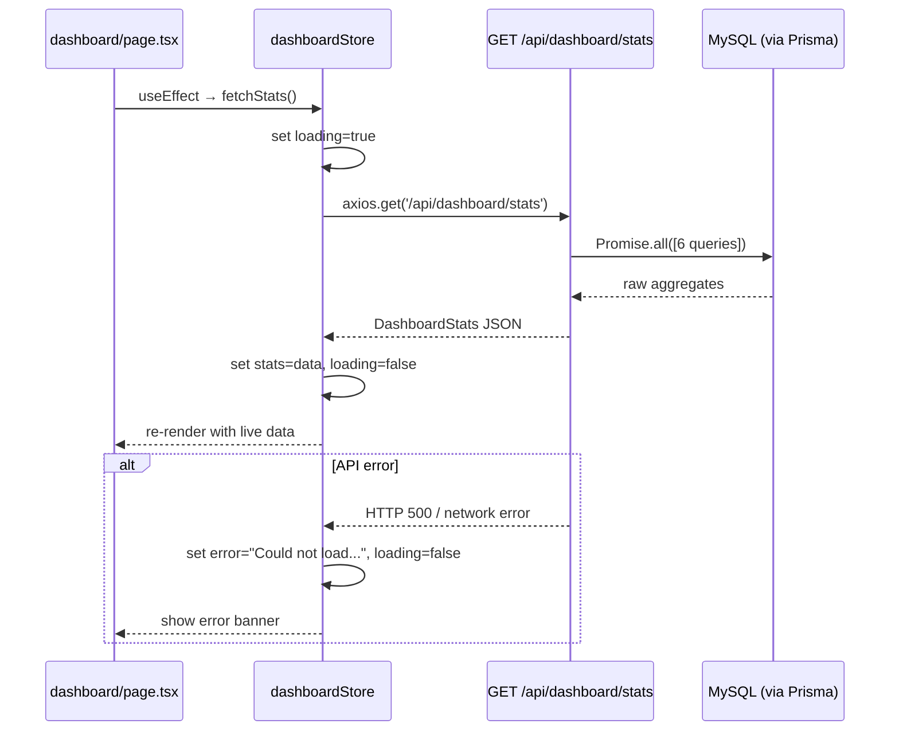

# Design: Dashboard Real Analytics

## Overview

This feature replaces all hardcoded/placeholder data in the Nexus Rent dashboard with live data
aggregated from the landlord's actual portfolio. A new `GET /api/dashboard/stats` endpoint
computes all required metrics in a single round trip; a lightweight Zustand store caches the
response for the current page session; and the `dashboard/page.tsx` is fully rewritten to
consume real data, render Recharts visualisations, and degrade gracefully on errors.

The scope is limited to the dashboard **Overview** view that already exists at
`frontend/app/dashboard/page.tsx`. No new pages or navigation changes are needed.

---

## Architecture

```
┌──────────────────────────────────────────────┐
│  Browser (Next.js 16 - App Router)           │
│                                              │
│  dashboard/page.tsx                          │
│    useEffect → dashboardStore.fetchStats()   │
│                    │                         │
│  dashboardStore.ts (Zustand, no persist)     │
│    stats | loading | error                   │
│                    │                         │
│  lib/api.ts (Axios + Bearer token)           │
└──────────────────┬───────────────────────────┘
                   │  GET /api/dashboard/stats
                   ▼
┌──────────────────────────────────────────────┐
│  Express (backend/src/index.ts)              │
│    app.use("/api/dashboard", dashboardRoutes)│
│                    │                         │
│  routes/dashboard.ts                         │
│    requireAuth → computeStats(userId)        │
│                    │                         │
│  Prisma ORM → MySQL                          │
│    Property, Lease, LeaseTenant,             │
│    Payment, RentSchedule, Expense, User      │
└──────────────────────────────────────────────┘
```

All queries in the stats endpoint are scoped via `where: { property: { landlordId: userId } }`
(or `where: { landlordId: userId }` directly on Property), ensuring complete tenant isolation.

---

## Components and Interfaces

### Backend

#### `backend/src/routes/dashboard.ts`

Single file exposing one route:

```
GET /api/dashboard/stats
  middleware: requireAuth
  handler:    getDashboardStats(req, res)
```

The handler runs 6 Prisma queries in parallel using `Promise.all` and assembles the response
shape defined below.

#### Response Shape

```typescript
interface DashboardStats {
  totalProperties:    number;          // count of landlord's properties
  activeLeases:       number;          // count of leases with status 'active'
  occupancyRate:      number;          // float 0–100
  monthlyRevenue:     number;          // sum of paid payments this calendar month
  totalArrears:       number;          // sum of overdue/unpaid scheduled amounts
  revenueTrend:       RevenueTrendItem[];  // last 6 months incl. current
  expenseByCategory:  ExpenseCategoryItem[];
  recentPayments:     RecentPayment[];    // last 5 paid payments
  leasesExpiringSoon: ExpiringLease[];    // ending within 30 days
}

interface RevenueTrendItem   { month: string; revenue: number }
interface ExpenseCategoryItem { category: string; total: number }
interface RecentPayment {
  id:            number;
  tenantName:    string;
  propertyTitle: string;
  amount:        number;
  paidAt:        string;  // ISO date string
  method:        string;
}
interface ExpiringLease {
  id:           number;
  propertyTitle: string;
  tenantNames:  string[];
  endDate:      string;  // ISO date string
}
```

#### Route Registration

Add to `backend/src/index.ts`:

```typescript
import dashboardRoutes from "./routes/dashboard.js";
// ...
app.use("/api/dashboard", dashboardRoutes);
```

---

### Frontend

#### `frontend/app/store/dashboardStore.ts`

New Zustand store (no `persist` — data must be fresh on every mount):

```typescript
interface DashboardStore {
  stats:      DashboardStats | null;
  loading:    boolean;
  error:      string | null;
  fetchStats: () => Promise<void>;
}
```

The `fetchStats()` action calls `GET /api/dashboard/stats` via the shared `api` Axios instance,
sets `loading` around the call, and stores either `stats` or `error`.

#### `frontend/app/dashboard/page.tsx`

Fully replaced. Calls `fetchStats()` in a `useEffect` on mount. Renders:

1. **4 KPI stat cards** — bound to `totalProperties`, `occupancyRate`, `monthlyRevenue`,
   `totalArrears`. Show pulse skeletons while `loading`.
2. **Revenue Trend LineChart** (Recharts `ResponsiveContainer` + `LineChart`)
3. **Expense Breakdown PieChart** (Recharts `PieChart` with `innerRadius` for donut style)
4. **Recent Payments list** (up to 5 rows)
5. **Leases Expiring Soon** (hidden when array is empty)
6. **Error banner** at top when `error` is set

---

## Data Models

### Arrears Calculation

```sql
-- Pseudocode (Prisma aggregate)
WHERE property.landlordId = :userId
  AND status IN ('overdue', 'scheduled')
  AND dueDate < NOW()
SUM(amount + COALESCE(lateFeeAmount, 0))
```

Both `overdue` rows and `scheduled` rows whose `dueDate` is in the past are treated as arrears.
Late fees already accrued (`lateFeeAmount`) are included in the total.

### Occupancy Rate Calculation

```
occupiedProperties = count of distinct propertyIds in Lease
                     where status='active'
                     and property.landlordId = userId

occupancyRate = (occupiedProperties / totalProperties) * 100
```

Returns 0 when `totalProperties` is 0 (no division-by-zero).

### Revenue Trend (last 6 months)

Generated using native `Date` arithmetic on the backend. For each of the 6 calendar months
(current month − 5 through current month inclusive):

```
monthStart = new Date(year, month, 1)
monthEnd   = new Date(year, month + 1, 1)

revenue = SUM(payment.amount)
  WHERE payment.status = 'paid'
    AND payment.paidAt >= monthStart
    AND payment.paidAt < monthEnd
    AND payment.property.landlordId = userId
```

Month labels are formatted as 3-letter abbreviations (`"Jan"`, `"Feb"`, …).

### Amount Formatting

All KES formatting is handled in the frontend:

```typescript
// Full format: KES 12,500
const formatKES = (n: number) =>
  `KES ${n.toLocaleString('en-KE', { maximumFractionDigits: 0 })}`;

// Chart Y-axis: KES 5K
const formatKESShort = (n: number) =>
  n >= 1000 ? `KES ${(n / 1000).toFixed(0)}K` : `KES ${n}`;
```

### Date Formatting

Payment dates are formatted using `date-fns` (already installed):

```typescript
import { format } from 'date-fns';
const formatDate = (iso: string) => format(new Date(iso), 'dd MMM yyyy');
```

---

## Correctness Properties

*A property is a characteristic or behavior that should hold true across all valid executions
of a system — essentially, a formal statement about what the system should do. Properties serve
as the bridge between human-readable specifications and machine-verifiable correctness
guarantees.*

### Property 1: Stats response structural completeness

*For any* landlord with any combination of properties (including zero), calling the stats
computation function SHALL return an object that contains every required field — `totalProperties`,
`activeLeases`, `occupancyRate`, `monthlyRevenue`, `totalArrears`, `revenueTrend`,
`expenseByCategory`, `recentPayments`, `leasesExpiringSoon` — where numerical fields are of
type `number` and array fields are arrays (possibly empty).

**Validates: Requirements 1.1, 1.2, 1.4**

---

### Property 2: Landlord data isolation

*For any* two distinct landlords A and B with non-overlapping property portfolios, the stats
computed for landlord A SHALL NOT include any monetary amounts, property counts, or tenant
identifiers that belong to landlord B's portfolio.

**Validates: Requirements 1.3**

---

### Property 3: Store state mirrors API response

*For any* valid `DashboardStats` object returned by a mocked API call, after `fetchStats()`
resolves the store's `stats` field SHALL be deeply equal to the returned object, `loading`
SHALL be `false`, and `error` SHALL be `null`.

**Validates: Requirements 2.1**

---

### Property 4: KES amount formatting correctness

*For any* non-negative number representing a monetary amount, `formatKES(n)` SHALL return a
string starting with `"KES "` followed by the number with comma-grouped thousands and no
decimal places. `formatKESShort(n)` SHALL return `"KES XK"` (rounded integer) for values
≥ 1,000 and `"KES X"` for smaller values.

**Validates: Requirements 3.3, 3.4, 4.4**

---

### Property 5: Payment row rendering completeness

*For any* `RecentPayment` object, the rendered payment row SHALL contain a string representation
of the tenant name, the property title, the amount formatted as `KES X,XXX`, the payment method,
and the date formatted as `DD MMM YYYY`.

**Validates: Requirements 6.2**

---

### Property 6: Leases expiring soon section visibility

*For any* `leasesExpiringSoon` array, the "Leases Expiring Soon" section SHALL be rendered
in the DOM when the array is non-empty and SHALL NOT be rendered when the array is empty.

**Validates: Requirements 7.1, 7.4**

---

### Property 7: Component renders without throwing for any valid stats shape

*For any* `DashboardStats` object where numerical fields are non-negative and array fields
are valid arrays (including empty), rendering the dashboard page SHALL NOT throw an exception
and SHALL display fallback content rather than an error boundary.

**Validates: Requirements 8.2**

---

## Error Handling

| Failure Scenario | Behaviour |
|---|---|
| `fetchStats()` network/server error | `error` state set; error banner shown at top of page; all cards render with `0` / empty arrays |
| `revenueTrend` is empty | LineChart renders with no data lines; no crash |
| `expenseByCategory` is empty | PieChart replaced by "No expenses recorded yet" message |
| `recentPayments` is empty | List replaced by "No payments yet" message |
| `leasesExpiringSoon` is empty | Section is completely hidden |
| `totalProperties` is 0 | `occupancyRate` returns `0` (no division-by-zero) |
| Auth token missing / expired | `requireAuth` returns 401; Axios interceptor redirects to `/login` |

The `fetchStats` action wraps the Axios call in `try/catch`. On catch it sets
`error: "Could not load dashboard data. Please refresh."` and keeps `loading: false`.
Individual components read from the store's `stats` field with nullish coalescing (`?? 0`,
`?? []`) so they never receive `undefined`.

---

## Testing Strategy

### Unit Tests

- `formatKES` and `formatKESShort` with a range of values (0, 999, 1000, 1500, 999999)
- `formatDate` with known ISO strings — verify `dd MMM yyyy` output
- `dashboardStore` initial state (all zeros / null)
- `fetchStats()` populates state correctly (mock Axios)
- `fetchStats()` on error sets `error` state and clears `loading`
- Stats computation helpers (arrears sum, occupancy rate) in isolation

### Property-Based Tests

Uses **fast-check** (compatible with Jest/Vitest; add as dev dependency).
Each test runs a minimum of **100 iterations**.

Tag format: `Feature: dashboard-real-analytics, Property N: <short description>`

**Property 1 test** — `statsStructuralCompleteness`:
Generate arbitrary landlord datasets (random counts of properties, leases, payments).
Call the stats computation logic. Assert all required keys are present with correct types.
`// Feature: dashboard-real-analytics, Property 1: stats response structural completeness`

**Property 2 test** — `landlordIsolation`:
Generate two landlords each with separate property/payment sets. Compute stats for each.
Assert no cross-contamination (no shared IDs, amounts sum to per-landlord totals only).
`// Feature: dashboard-real-analytics, Property 2: landlord data isolation`

**Property 3 test** — `storeStateRoundTrip`:
Generate random `DashboardStats` objects. Mock `api.get` to return them. Call `fetchStats()`.
Assert `store.stats` deeply equals the generated object.
`// Feature: dashboard-real-analytics, Property 3: store state mirrors API response`

**Property 4 test** — `kesFormattingInvariant`:
Generate random non-negative floats. Apply `formatKES` and `formatKESShort`. Assert format
invariants (starts with "KES ", correct K-suffix threshold, no decimals in full format).
`// Feature: dashboard-real-analytics, Property 4: KES amount formatting correctness`

**Property 5 test** — `paymentRowCompleteness`:
Generate random `RecentPayment` objects. Shallow-render the payment row component. Assert
tenant name, property title, formatted amount, method, and date are all present in output.
`// Feature: dashboard-real-analytics, Property 5: payment row rendering completeness`

**Property 6 test** — `expiringLeasesVisibility`:
Generate arrays of `ExpiringLease` with lengths 0 through N (arbitrary). Render the dashboard.
Assert section is present iff `length > 0`.
`// Feature: dashboard-real-analytics, Property 6: leases expiring soon visibility`

**Property 7 test** — `componentRobustness`:
Generate arbitrary valid `DashboardStats` (including min-value edge cases: all zeros, all empty
arrays). Render the dashboard page wrapped in an error boundary. Assert no exceptions are thrown
and the error boundary is never triggered.
`// Feature: dashboard-real-analytics, Property 7: component renders without throwing`

### Integration Tests

- `GET /api/dashboard/stats` returns 401 without a token (smoke: auth guard works)
- `GET /api/dashboard/stats` returns 200 with all required fields for a seeded landlord
- Verify monetary amounts in response are numbers, not strings
- Verify `revenueTrend` array has exactly 6 elements

### Mermaid: Component Interaction Flow


