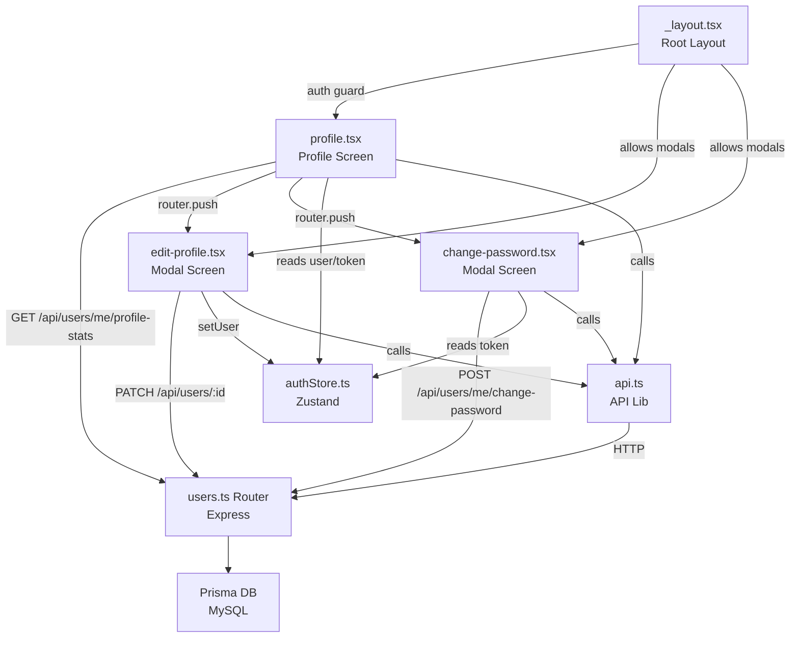
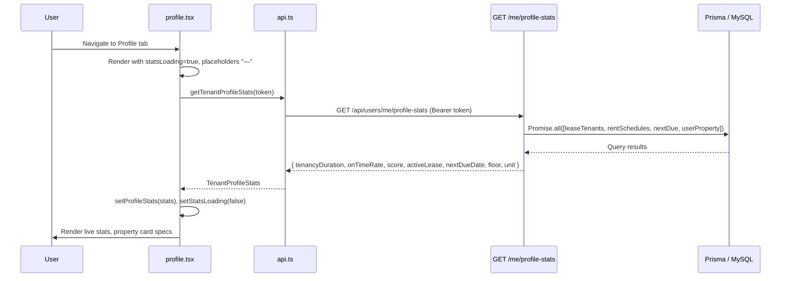
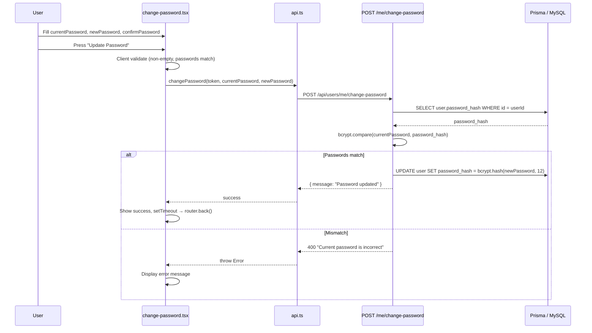
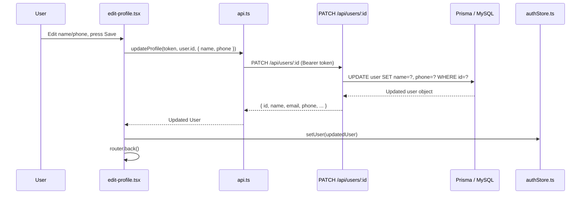

# Design Document: Mobile Profile Improvements

## Overview

The mobile Profile screen currently renders hardcoded tenant statistics, incorrect property details drawn from stale `Property` model fields, and two non-functional preference items ("Edit Profile" and "Security & Password"). This feature replaces all hardcoded values with live data from a new backend stats endpoint, adds a password-change endpoint, implements two new Expo Router modal screens, and wires up navigation — all within the existing Express/Prisma backend and React Native / Expo Router frontend.

The implementation touches six files and adds two new files, with no schema migrations required. The Prisma schema already contains all relations needed (`LeaseTenant → Lease → UnitType`, `RentSchedule`, `UserProperty`).

---

## Architecture



---

## Sequence Diagrams

### Profile Screen Mount (Stats + Property Card)



### Change Password Flow



### Edit Profile Flow



---

## Components and Interfaces

### Backend: `GET /api/users/me/profile-stats`

**Route file**: `backend/src/routes/users.ts`  
**Placement**: BEFORE `router.get('/:id', ...)` to prevent Express treating `"me"` as a user ID parameter.

**Interface** (response shape):

```typescript
interface ProfileStatsResponse {
  tenancyDuration: string;        // "3 yr(s)" | "5 mo" | "—"
  onTimeRate: number;             // e.g. 97.5 (percentage, 1 dp)
  score: number;                  // 0–100 integer
  activeLease: {
    id: number;
    rentAmount: number;
    startDate: string;            // ISO 8601
    endDate: string;              // ISO 8601
    status: string;               // "active"
    billingCycle: string;         // "monthly" | "weekly"
    unitType: {
      type: string;               // e.g. "2 Bedroom"
      baths: number;
      price: number;
    } | null;
  } | null;
  nextDueDate: string | null;     // ISO 8601 or null
  floor: string | null;
  unit: string | null;
}
```

**Responsibilities**:
- Authenticate via `requireAuth` middleware (returns 401 on failure)
- Run four queries in parallel via `Promise.all`
- Compute `tenancyDuration`, `onTimeRate`, and `score` server-side
- Return a single flat JSON response

---

### Backend: `POST /api/users/me/change-password`

**Route file**: `backend/src/routes/users.ts`  
**Placement**: BEFORE `router.get('/:id', ...)`.

**Request body**:

```typescript
interface ChangePasswordBody {
  currentPassword: string;
  newPassword: string;
}
```

**Responsibilities**:
- Authenticate via `requireAuth`
- Validate both fields are present
- Verify current password with bcrypt
- Hash new password with bcrypt cost factor 12
- Update `password_hash` in DB
- Return `{ message: "Password updated" }` on success

---

### Mobile: `TenantProfileStats` interface (`mobile/lib/api.ts`)

```typescript
export interface TenantProfileStats {
  tenancyDuration: string;
  onTimeRate: number;
  score: number;
  activeLease: {
    id: number;
    rentAmount: number;
    startDate: string;
    endDate: string;
    status: string;
    billingCycle: string;
    unitType: { type: string; baths: number; price: number } | null;
  } | null;
  nextDueDate: string | null;
  floor: string | null;
  unit: string | null;
}
```

---

### Mobile: API Lib additions (`mobile/lib/api.ts`)

Three new methods added to the existing `api` object:

```typescript
async getTenantProfileStats(token: string): Promise<TenantProfileStats>
async changePassword(token: string, currentPassword: string, newPassword: string): Promise<{ message: string }>
async updateProfile(token: string, userId: number, data: { name?: string; phone?: string }): Promise<User>
```

All three throw `Error` with status code + body on non-2xx responses.

---

### Mobile: Auth Store (`mobile/store/authStore.ts`)

New action added to `AuthState` interface and implementation:

```typescript
setUser: (user: User) => void
// implementation: set({ user })
```

Used by `edit-profile.tsx` after a successful profile update to keep the Zustand store in sync without a full re-login.

---

### Mobile: Profile Screen (`mobile/app/(tabs)/profile.tsx`)

**New state**:

```typescript
const [profileStats, setProfileStats] = useState<TenantProfileStats | null>(null);
const [statsLoading, setStatsLoading] = useState(true);
```

**New fetch logic** (`fetchProfileStats`):
- Called on mount via `useEffect`
- Called on screen focus via `useFocusEffect` (imported from `@react-navigation/native`, consistent with existing navigation imports in the file)
- Sets `statsLoading = true` before each fetch, `false` in `finally`
- On error: sets `profileStats = null`, does NOT throw

**Stats Card binding**:

| Stat | Loading | Loaded |
|------|---------|--------|
| Tenancy | `"—"` | `profileStats.tenancyDuration` |
| On-Time | `"—"` | `` `${profileStats.onTimeRate}%` `` |
| Score | `"—"` | `profileStats.score.toString()` |

**Property Card binding** (replaces hardcoded `specs` array):
- Unit type label: `activeLease?.unitType?.type ?? "—"`
- Bath count label: `` activeLease?.unitType ? `${activeLease.unitType.baths} Baths` : "—" ``
- Next due date: `profileStats?.nextDueDate ? formatDate(profileStats.nextDueDate) : "—"`
- Rent amount: `` activeLease?.rentAmount ? `Ksh${activeLease.rentAmount.toLocaleString()}/mo` : ... ``
- Badge text: `` activeLease?.status?.toUpperCase() ?? "NO LEASE" ``
- Floor/unit line: conditional render when `profileStats?.floor || profileStats?.unit`

**Navigation wiring** in `preferenceItems`:
- Edit Profile `onPress`: `() => router.push('/(modals)/edit-profile')`
- Security & Password `onPress`: `() => router.push('/(modals)/change-password')`

**Helper function** (added to module scope):

```typescript
function formatDate(isoString: string): string {
  return new Date(isoString).toLocaleDateString('en-US', { month: 'short', day: 'numeric' });
  // e.g. "Aug 19"
}
```

---

### Mobile: Edit Profile Screen (`mobile/app/(modals)/edit-profile.tsx`)

**Component state**:

```typescript
const [name, setName] = useState(user?.name ?? '');
const [phone, setPhone] = useState(user?.phone ?? '');
const [loading, setLoading] = useState(false);
const [error, setError] = useState<string | null>(null);
```

**Layout elements**:
- Back button (calls `router.back()`)
- Name `TextInput` (pre-populated, editable)
- Phone `TextInput` (pre-populated, editable, `keyboardType="phone-pad"`)
- Email `Text` (read-only, styled differently)
- Save `TouchableOpacity` (disabled + reduced opacity while `loading`)
- Error `Text` (shown when `error !== null`)

**Submit logic**:

```typescript
async function handleSave() {
  if (!token || !user) return;
  setLoading(true);
  setError(null);
  try {
    const updated = await api.updateProfile(token, user.id, { name, phone });
    setUser(updated);
    router.back();
  } catch (e: any) {
    setError(e.message ?? 'Failed to update profile');
  } finally {
    setLoading(false);
  }
}
```

**Styling**: Dark theme matching `profile.tsx` — `#060A14` background, `#111827` inputs, `#00F0FF` accent colour.

---

### Mobile: Change Password Screen (`mobile/app/(modals)/change-password.tsx`)

**Component state**:

```typescript
const [currentPassword, setCurrentPassword] = useState('');
const [newPassword, setNewPassword] = useState('');
const [confirmPassword, setConfirmPassword] = useState('');
const [loading, setLoading] = useState(false);
const [error, setError] = useState<string | null>(null);
const [success, setSuccess] = useState(false);
```

**Layout elements**:
- Back button
- Three `TextInput` fields with `secureTextEntry`
- Update Password `TouchableOpacity` (disabled while `loading`)
- Error `Text` (conditional)
- Success `Text` (conditional, shown after successful change)

**Submit logic**:

```typescript
async function handleSubmit() {
  if (!currentPassword || !newPassword || !confirmPassword) {
    setError('All fields are required');
    return;
  }
  if (newPassword !== confirmPassword) {
    setError('New passwords do not match');
    return;
  }
  if (!token) return;
  setLoading(true);
  setError(null);
  try {
    await api.changePassword(token, currentPassword, newPassword);
    setSuccess(true);
    setTimeout(() => router.back(), 1500);
  } catch (e: any) {
    setError(e.message ?? 'Failed to change password');
  } finally {
    setLoading(false);
  }
}
```

**Styling**: Same dark theme as `edit-profile.tsx`.

---

### Mobile: Root Layout (`mobile/app/_layout.tsx`)

**Auth guard update** — add `isModalsRoute` guard to prevent redirect away from modal screens:

```typescript
const isModalsRoute = segments[0] === '(modals)';

// Existing redirect condition — add !isModalsRoute:
if (
  (auth.token || (auth.tempToken && !auth.isFirstLogin)) &&
  !inTabsGroup && !isAuthFlow && !isServicesRoute &&
  !isContactsRoute && !isChatbotRoute && !isAuditRoute &&
  !isPayRoute && !isPropertiesRoute && !isModalsRoute
) {
  router.replace('/(tabs)/home');
}
```

No new stack screens need to be registered — Expo Router's file-based routing discovers `(modals)/edit-profile.tsx` and `(modals)/change-password.tsx` automatically via the `<Stack>` in `_layout.tsx`.

---

## Data Models

### Prisma Queries in `GET /me/profile-stats`

All four queries run in parallel:

**Query A — Lease Tenants** (for tenancy duration + active lease):
```typescript
db.leaseTenant.findMany({
  where: { tenantId: userId },
  include: {
    lease: {
      select: {
        id: true, rentAmount: true, startDate: true, endDate: true,
        status: true, billingCycle: true,
        unitType: { select: { type: true, baths: true, price: true } },
      },
    },
  },
})
```

**Query B — Rent Schedule counts** (for onTimeRate + score):
```typescript
db.rentSchedule.findMany({
  where: { tenantId: userId, dueDate: { lte: new Date() } },
  select: { status: true },
})
// + separate count for overdue across ALL schedules:
db.rentSchedule.findMany({
  where: { tenantId: userId },
  select: { status: true },
})
```
> In practice these can be combined into a single `findMany` fetching all schedules, then partitioned in memory.

**Query C — Next upcoming schedule**:
```typescript
db.rentSchedule.findFirst({
  where: {
    tenantId: userId,
    status: { in: ['scheduled', 'overdue'] },
  },
  orderBy: { dueDate: 'asc' },
  select: { dueDate: true },
})
```

**Query D — UserProperty** (for floor/unit):
```typescript
db.userProperty.findFirst({
  where: { userId },
  select: { floor: true, unit: true },
})
```

### Computation Logic

```typescript
// tenancyDuration
const leases = leaseTenants
  .filter(lt => ['active', 'ended'].includes(lt.lease.status))
  .map(lt => lt.lease);
const earliest = leases.sort((a, b) =>
  new Date(a.startDate).getTime() - new Date(b.startDate).getTime()
)[0];
const months = earliest
  ? Math.floor((Date.now() - new Date(earliest.startDate).getTime()) / (1000 * 60 * 60 * 24 * 30.44))
  : null;
const tenancyDuration = months === null
  ? '—'
  : months >= 12
    ? `${Math.floor(months / 12)} yr(s)`
    : `${months} mo`;

// onTimeRate
const pastDue = allSchedules.filter(s => new Date(s.dueDate) <= now);
const paidCount = pastDue.filter(s => s.status === 'paid').length;
const pastDueTotal = pastDue.length;
const onTimeRate = pastDueTotal === 0
  ? 100.0
  : Math.round((paidCount / pastDueTotal) * 1000) / 10;  // 1 dp

// score
const overdueCount = allSchedules.filter(s => s.status === 'overdue').length;
const totalScheduleCount = allSchedules.length;
const penalty = (overdueCount / Math.max(totalScheduleCount, 1)) * 10;
const score = Math.max(0, Math.min(100, Math.floor(onTimeRate - penalty)));

// activeLease
const activeLease = leaseTenants
  .map(lt => lt.lease)
  .filter(l => l.status === 'active')
  .sort((a, b) => new Date(b.startDate).getTime() - new Date(a.startDate).getTime())[0] ?? null;
```

---

## Algorithmic Pseudocode

### `GET /me/profile-stats` Handler

```pascal
PROCEDURE handleProfileStats(req, res)
  INPUT: authenticated request (userId from JWT)
  OUTPUT: JSON response { tenancyDuration, onTimeRate, score, activeLease, nextDueDate, floor, unit }

  BEGIN
    userId ← req.userId

    // Run four queries in parallel
    [leaseTenants, allSchedules, nextSchedule, userProperty] ← Promise.all([
      queryA(userId),
      queryBall(userId),
      queryC(userId),
      queryD(userId)
    ])

    // Tenancy Duration
    eligibleLeases ← leaseTenants WHERE lease.status IN ["active", "ended"]
    IF eligibleLeases IS EMPTY THEN
      tenancyDuration ← "—"
    ELSE
      earliest ← MIN(eligibleLeases, BY lease.startDate)
      months ← FLOOR((NOW - earliest.startDate) / 30.44 days)
      IF months >= 12 THEN
        tenancyDuration ← FLOOR(months / 12) + " yr(s)"
      ELSE
        tenancyDuration ← months + " mo"
      END IF
    END IF

    // On-Time Rate
    pastDueSchedules ← allSchedules WHERE dueDate <= NOW
    paidCount ← COUNT(pastDueSchedules WHERE status = "paid")
    pastDueTotal ← COUNT(pastDueSchedules)
    IF pastDueTotal = 0 THEN
      onTimeRate ← 100.0
    ELSE
      onTimeRate ← ROUND((paidCount / pastDueTotal * 100), 1 dp)
    END IF

    // Score
    overdueCount ← COUNT(allSchedules WHERE status = "overdue")
    totalScheduleCount ← COUNT(allSchedules)
    penalty ← (overdueCount / MAX(totalScheduleCount, 1)) * 10
    score ← CLAMP(FLOOR(onTimeRate - penalty), 0, 100)

    // Active Lease
    activeLeases ← leaseTenants WHERE lease.status = "active"
    activeLease ← LATEST(activeLeases BY lease.startDate) OR null

    // Next Due Date
    nextDueDate ← nextSchedule.dueDate AS ISO string OR null

    // Floor / Unit
    floor ← userProperty.floor OR null
    unit ← userProperty.unit OR null

    res.json({ tenancyDuration, onTimeRate, score, activeLease, nextDueDate, floor, unit })
  END
END PROCEDURE
```

### `POST /me/change-password` Handler

```pascal
PROCEDURE handleChangePassword(req, res)
  INPUT: authenticated request, body { currentPassword, newPassword }
  OUTPUT: 200 { message } or 400 { error }

  BEGIN
    { currentPassword, newPassword } ← req.body
    userId ← req.userId

    IF currentPassword IS EMPTY OR newPassword IS EMPTY THEN
      RETURN res.status(400).json({ error: "currentPassword and newPassword are required" })
    END IF

    user ← db.user.findUnique({ where: { id: userId }, select: { password_hash } })

    match ← bcrypt.compare(currentPassword, user.password_hash)

    IF match = false THEN
      RETURN res.status(400).json({ error: "Current password is incorrect" })
    END IF

    newHash ← bcrypt.hash(newPassword, 12)
    db.user.update({ where: { id: userId }, data: { password_hash: newHash } })

    RETURN res.status(200).json({ message: "Password updated" })
  END
END PROCEDURE
```

---

## Key Functions with Formal Specifications

### `GET /me/profile-stats` route handler

**Preconditions:**
- `req.userId` is a valid integer set by `requireAuth` middleware
- Database connection is available

**Postconditions:**
- Returns HTTP 200 with all seven fields populated
- `onTimeRate` is in range [0, 100] with exactly one decimal place
- `score` is an integer in range [0, 100]
- `tenancyDuration` matches pattern `/^\d+ (yr\(s\)|mo)|—$/`
- If `activeLease` is non-null, `activeLease.id` corresponds to an existing `Lease` row with `status = "active"`

**Loop Invariant (schedule partition loop):**
- After processing `k` schedules, `paidCount ≤ pastDueTotal ≤ k`

---

### `fetchProfileStats` (profile.tsx)

**Preconditions:**
- `token` is a non-null string in auth store

**Postconditions:**
- `statsLoading` is `false` when the function returns (success or error)
- `profileStats` is either a valid `TenantProfileStats` object or `null`
- No unhandled promise rejections are emitted

---

### `handleSave` (edit-profile.tsx)

**Preconditions:**
- `token` and `user` are non-null

**Postconditions:**
- On success: auth store `user` is updated with returned data; screen navigates back
- On failure: `error` state is set to a non-empty string; navigation does not occur
- `loading` is `false` in all exit paths

---

### `handleSubmit` (change-password.tsx)

**Preconditions:**
- All three password fields are non-empty strings (validated client-side)
- `newPassword === confirmPassword` (validated client-side)
- `token` is non-null

**Postconditions:**
- On success: `success` is `true`; `router.back()` is called after 1500ms
- On API error: `error` contains the server error message; navigation does not occur
- `loading` is `false` in all exit paths

---

## Error Handling

### Scenario 1: Stats fetch fails (network error or 5xx)

**Condition**: `getTenantProfileStats` throws or returns non-2xx  
**Response**: `profileStats` set to `null`, `statsLoading` set to `false`  
**Recovery**: All API-dependent fields display `"—"` — screen remains fully functional

### Scenario 2: Change password — current password wrong

**Condition**: Backend returns HTTP 400 `"Current password is incorrect"`  
**Response**: API lib throws `Error("Current password is incorrect")`, caught in `change-password.tsx`  
**Recovery**: Inline error message shown; form stays open; user can retry

### Scenario 3: Change password — missing fields

**Condition**: Client submits with empty input(s)  
**Response**: Client-side guard fires before API call; error message displayed  
**Recovery**: No network request made; form remains open

### Scenario 4: Edit profile — server error

**Condition**: `updateProfile` returns non-2xx  
**Response**: `error` state set; auth store not updated  
**Recovery**: Inline error shown; user can retry or navigate back manually

### Scenario 5: Express route ordering — `"me"` captured as `:id`

**Condition**: `/me/profile-stats` and `/me/change-password` routes placed AFTER `/:id`  
**Prevention**: These routes are placed explicitly before `router.get('/:id', ...)` in `users.ts`  
**Effect if ignored**: Express would treat `"me"` as a user ID, return 400 (NaN parse) or wrong user

### Scenario 6: Modal screen auth redirect loop

**Condition**: User navigates to `/(modals)/edit-profile` but `_layout.tsx` auth guard redirects to `/(tabs)/home`  
**Prevention**: `isModalsRoute` guard added to the redirect condition  
**Recovery**: Modal screen renders correctly; no redirect

---

## Testing Strategy

### Unit Testing Approach

Each computation function should be tested in isolation:

- `tenancyDuration` derivation: test with 0 leases, 1 lease (< 12 mo), 1 lease (≥ 12 mo), multiple leases
- `onTimeRate` calculation: test with 0 past-due schedules (→ 100.0), all paid, none paid, mixed
- `score` clamping: verify floor at 0, ceiling at 100, and penalty subtraction
- Client-side validation in `change-password.tsx`: empty fields, mismatched passwords

### Property-Based Testing Approach

**Property Test Library**: fast-check (TypeScript)

Key properties to verify:

```typescript
// onTimeRate is always in [0.0, 100.0]
fc.property(
  fc.nat(200), fc.nat(200),
  (paidCount, totalCount) => {
    const pastDueTotal = Math.max(paidCount, totalCount);
    const rate = pastDueTotal === 0 ? 100.0 : Math.round((paidCount / pastDueTotal) * 1000) / 10;
    return rate >= 0 && rate <= 100;
  }
)

// score is always an integer in [0, 100]
fc.property(
  fc.float({ min: 0, max: 100 }), fc.nat(100), fc.nat(100),
  (onTimeRate, overdueCount, totalCount) => {
    const penalty = (overdueCount / Math.max(totalCount, 1)) * 10;
    const score = Math.max(0, Math.min(100, Math.floor(onTimeRate - penalty)));
    return Number.isInteger(score) && score >= 0 && score <= 100;
  }
)
```

### Integration Testing Approach

- Backend: seed a test tenant with known lease/schedule data; call `/api/users/me/profile-stats` and assert exact field values
- Mobile: render `profile.tsx` with a mocked API response; assert Stats_Card text matches the mock data
- End-to-end: navigate to Profile tab, verify stats load, navigate to Edit Profile, change name, return and verify updated name

---

## Performance Considerations

- All four Prisma queries for `GET /me/profile-stats` run in a single `Promise.all`, keeping total response latency near the slowest individual query rather than their sum.
- Schedule counting is done by fetching all `RentSchedule` records for the tenant (typically < 100 rows) and partitioning in memory — more efficient than multiple `db.rentSchedule.count()` calls due to connection overhead.
- The `useFocusEffect` re-fetch on profile screen focus is lightweight since the endpoint is tenant-scoped (no full table scans).
- Prisma indices on `RentSchedule(tenantId)`, `LeaseTenant(tenantId)`, and `UserProperty(userId, propertyId, roleId)` already exist in the schema, ensuring fast lookups.

---

## Security Considerations

- Both new routes are protected by the existing `requireAuth` middleware, which validates the JWT and sets `req.userId`. No additional auth logic is needed.
- `GET /me/profile-stats` and `POST /me/change-password` both scope queries to `req.userId` — tenants can only access their own data.
- `bcrypt.compare` is used for constant-time password verification, preventing timing attacks.
- The new password is hashed with cost factor 12 (`bcrypt.hash(newPassword, 12)`), consistent with the rest of the codebase.
- The `PATCH /api/users/:id` endpoint already strips `email` from the update payload (`if (data.email) delete data.email`) so the edit-profile screen cannot change a user's email address.
- `updateProfile` in `api.ts` sends only `{ name, phone }` — no other fields are passed.

---

## Dependencies

All dependencies are already present in the project. No new packages are required.

| Dependency | Location | Already Present |
|---|---|---|
| `bcrypt` | `backend/src/routes/users.ts` | ✅ (imported at top of file) |
| `@prisma/client` | backend | ✅ |
| `expo-router` | mobile | ✅ (`useRouter`, `useFocusEffect` via `@react-navigation/native`) |
| `@react-navigation/native` | mobile | ✅ (`useFocusEffect` used in other screens) |
| `zustand` | mobile | ✅ |
| `react-native` (`TextInput`, `TouchableOpacity`, etc.) | mobile | ✅ |
| `expo-linear-gradient` | mobile | ✅ (used in `profile.tsx`) |

---

## Correctness Properties

The following universal invariants must hold across all inputs and states:

### Property 1: onTimeRate bounds

**Validates: Requirements 1.4, 1.5**

For any tenant with any number of RentSchedule records, `onTimeRate` is always in the closed interval [0.0, 100.0]. When `pastDueTotal = 0`, `onTimeRate = 100.0` exactly.

### Property 2: score bounds and integrality

**Validates: Requirements 1.6**

For any combination of `onTimeRate` and overdue schedule counts, `score` is always an integer in the closed interval [0, 100]. The `Math.floor` and `Math.max(0, Math.min(100, ...))` guards ensure this unconditionally.

### Property 3: score is at most onTimeRate

**Validates: Requirements 1.6**

Because the penalty term is non-negative (`overdueCount / Math.max(totalScheduleCount, 1) * 10 ≥ 0`), the score after flooring is always less than or equal to `onTimeRate`.

### Property 4: tenancyDuration format

**Validates: Requirements 1.2, 1.3**

The returned string always matches one of three forms: `"—"` (no eligible leases), `"N yr(s)"` (months ≥ 12), or `"N mo"` (months < 12). It is never an empty string or `null`.

### Property 5: activeLease consistency

**Validates: Requirements 1.7, 1.8, 1.9**

If `activeLease` is non-null in the response, `activeLease.status` equals `"active"` (the query filter enforces this). It is never the case that `activeLease` is non-null but has a different status.

### Property 6: nextDueDate is the earliest upcoming schedule

**Validates: Requirements 1.10, 1.11**

If `nextDueDate` is non-null, the corresponding `RentSchedule` has `status IN ["scheduled", "overdue"]` and its `dueDate` is ≤ all other upcoming schedules (the `orderBy dueDate asc, take 1` query ensures this).

### Property 7: API error propagation

**Validates: Requirements 3.4**

All three new `api.ts` functions throw an `Error` instance (never silently return `undefined` or swallow errors) when the HTTP response status is non-2xx. Callers can always rely on `try/catch` for error handling.

### Property 8: loading state completeness

**Validates: Requirements 4.1, 8.2**

`statsLoading` is set to `false` in the `finally` block of `fetchProfileStats`, guaranteeing it transitions from `true` to `false` regardless of whether the fetch succeeds or throws. No path exists where `statsLoading` remains `true` after the async function completes.

### Property 9: auth guard idempotency

**Validates: Requirements 6.1, 7.1**

Adding `isModalsRoute` to the redirect condition is purely additive — it adds a new exclusion path and does not affect any existing route's behaviour. The existing `isServicesRoute`, `isContactsRoute`, etc. guards remain unchanged.

### Property 10: setUser does not clear token

**Validates: Requirements 6.6**

The new `setUser` action calls `set({ user })` which merges into Zustand state via shallow merge. It does not touch `token`, `tempToken`, or any other auth field, preserving the authenticated session after a profile update.
