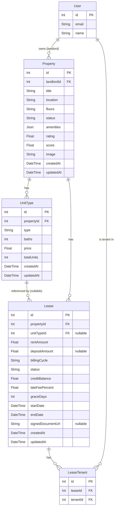

# Design Document — Multi-Unit Property & Lease Overhaul

## Overview

The Nexus Rent platform currently stores unit-level pricing data (`price`, `beds`, `baths`, `sqft`) as flat columns on the `Property` model. The frontend `PropertyForm` was already refactored to collect structured `unitTypes` arrays, but the backend schema and API never caught up, leaving the system in an inconsistent state.

This overhaul brings the entire stack into alignment with the multi-unit data model:

1. **Schema**: Remove flat fields from `Property`, rename `floor → floors`, and introduce a new `UnitType` child model.
2. **Property API**: Accept and return `unitTypes` on all CRUD endpoints.
3. **Lease Model & API**: Add `unitTypeId` (nullable FK) and `depositAmount`; derive `rentAmount` from the unit type when a unit type is selected.
4. **Frontend Store**: Update `Property` and `Lease` interfaces to match new shapes.
5. **LeaseForm UI**: Add a property→unit type cascade dropdown and auto-fill rent amount.
6. **Dashboard**: Replace the property-count-based occupancy rate with a unit-count formula.

Backward compatibility is maintained throughout: existing properties with no `UnitType` records function normally, and legacy leases without a `unitTypeId` continue to allow manual `rentAmount` entry.

---

## Architecture

The feature touches all three tiers:

```
┌───────────────────────────────────────────────────────────────┐
│  Frontend (Next.js 14 App Router)                             │
│                                                               │
│  adminStore.ts  ─ Property interface + Lease type updated     │
│  LeaseForm.tsx  ─ cascade dropdown + auto-fill rent           │
│  PropertyForm.tsx ─ already correct (no changes needed)       │
└─────────────────────────────┬─────────────────────────────────┘
                              │ HTTP / REST
┌─────────────────────────────▼─────────────────────────────────┐
│  Backend (Express + TypeScript)                               │
│                                                               │
│  routes/properties.ts  ─ unitTypes nested CRUD               │
│  routes/leases.ts      ─ unitTypeId lookup + depositAmount    │
│  routes/dashboard.ts   ─ new occupancy rate formula           │
└─────────────────────────────┬─────────────────────────────────┘
                              │ Prisma ORM
┌─────────────────────────────▼─────────────────────────────────┐
│  MySQL Database                                               │
│                                                               │
│  Property ──< UnitType ──< Lease (nullable unitTypeId)        │
└───────────────────────────────────────────────────────────────┘
```

No new external services or infrastructure are introduced. All changes are contained within the existing Express app, Prisma schema, and Next.js frontend.

---

## Components and Interfaces

### Backend Components

#### `backend/prisma/schema.prisma`
- Remove `price`, `beds`, `baths`, `sqft` from `Property`.
- Rename `floor String?` → `floors String?`.
- Add `UnitType` model.
- Add `unitTypeId Int?` and `depositAmount Float?` to `Lease`.

#### `backend/src/routes/properties.ts`
- `CreatePropertyInput` / `UpdatePropertyInput` interfaces replace removed flat fields with `floors?: string` and `unitTypes?: UnitTypeInput[]`.
- `POST /api/properties`: validate `unitTypes` length ≥ 1, use Prisma nested `create` to persist unit types atomically.
- `PATCH /api/properties/:id`: when `unitTypes` is present and non-empty, run `deleteMany` then `createMany` in a transaction.
- All `select` clauses extended with `unitTypes: true`.

#### `backend/src/routes/leases.ts`
- `leaseInclude` gains `unitType: true` and the existing `property` include gains `unitTypes: true`.
- `POST /api/leases`: when `unitTypeId` is present, look up `UnitType`, validate it belongs to `propertyId`, set `rentAmount = unitType.price`.
- `PATCH /api/leases/:id`: add `unitTypeId` and `depositAmount` to the editable-fields list; when `unitTypeId` is updated, re-derive `rentAmount`.

#### `backend/src/routes/dashboard.ts`
- Replace the `occupiedPropertyIds` query with a unit-count approach (see Data Models section for formula detail).

### Frontend Components

#### `frontend/types/lease.ts`
- `Lease` interface: add `unitTypeId?: number | null`, `depositAmount?: number | null`.
- `Lease.property` shape: extend with `unitTypes: UnitType[]`.
- Add exported `UnitType` interface.
- `CreateLeaseInput` / `UpdateLeaseInput`: add `unitTypeId?: number`, `depositAmount?: number`.

#### `frontend/app/store/adminStore.ts`
- `Property` interface: remove `price`, `beds`, `baths`, `sqft`; add `floors?: string`; add `unitTypes: UnitType[]`.
- Export `UnitType` interface: `{ id: number; propertyId: number; type: string; baths: number; price: number; totalUnits: number }`.

#### `frontend/app/components/leases/LeaseForm.tsx`
- Add `unitTypeId` and `depositAmount` to form state.
- Add a "Unit Type" `CustomDropdown` in the Agreement Details section, populated from `properties.find(p => p.id === data.propertyId)?.unitTypes`.
- When property changes, reset `unitTypeId` and `rentAmount`.
- When a unit type is selected, set `rentAmount = unitType.price` (read-only display) and `unitTypeId`.
- Add "Deposit Amount" numeric input in the Financial Terms section.
- For edit mode with existing `unitTypeId`: pre-populate unit type dropdown and show `rentAmount` as read-only.
- For edit mode without `unitTypeId` (legacy): `rentAmount` remains editable.

### API Contracts

#### `POST /api/properties` — Request
```json
{
  "title": "Westlands Heights",
  "location": "Westlands, Nairobi",
  "floors": "G+5",
  "status": "active",
  "amenities": ["parking", "gym"],
  "unitTypes": [
    { "type": "1br", "baths": 1, "price": 18000, "totalUnits": 10 },
    { "type": "2br", "baths": 2, "price": 28000, "totalUnits": 6 }
  ]
}
```

#### `POST /api/properties` — Response `201`
```json
{
  "id": 42,
  "title": "Westlands Heights",
  "location": "Westlands, Nairobi",
  "floors": "G+5",
  "status": "active",
  "amenities": ["parking", "gym"],
  "image": null,
  "createdAt": "2025-07-01T10:00:00.000Z",
  "unitTypes": [
    { "id": 1, "propertyId": 42, "type": "1br", "baths": 1, "price": 18000, "totalUnits": 10 },
    { "id": 2, "propertyId": 42, "type": "2br", "baths": 2, "price": 28000, "totalUnits": 6 }
  ]
}
```

#### `POST /api/leases` — Request (with unit type)
```json
{
  "propertyId": 42,
  "tenantIds": [7],
  "startDate": "2025-08-01",
  "endDate": "2026-07-31",
  "unitTypeId": 2,
  "depositAmount": 56000,
  "billingCycle": "monthly",
  "status": "active",
  "lateFeePercent": 5,
  "graceDays": 7
}
```
Note: `rentAmount` is omitted — the server derives it from `UnitType.price`.

#### `POST /api/leases` — Request (legacy, no unit type)
```json
{
  "propertyId": 42,
  "tenantIds": [7],
  "startDate": "2025-08-01",
  "endDate": "2026-07-31",
  "rentAmount": 25000,
  "billingCycle": "monthly"
}
```

#### `POST /api/leases` — Response `201`
```json
{
  "lease": {
    "id": 15,
    "propertyId": 42,
    "unitTypeId": 2,
    "rentAmount": 28000,
    "depositAmount": 56000,
    "startDate": "2025-08-01T00:00:00.000Z",
    "endDate": "2026-07-31T00:00:00.000Z",
    "billingCycle": "monthly",
    "status": "active",
    "lateFeePercent": 5,
    "graceDays": 7,
    "creditBalance": 0,
    "signedDocumentUrl": null,
    "createdAt": "...",
    "updatedAt": "...",
    "property": {
      "id": 42,
      "title": "Westlands Heights",
      "location": "Westlands, Nairobi",
      "unitTypes": [
        { "id": 1, "propertyId": 42, "type": "1br", "baths": 1, "price": 18000, "totalUnits": 10 },
        { "id": 2, "propertyId": 42, "type": "2br", "baths": 2, "price": 28000, "totalUnits": 6 }
      ]
    },
    "unitType": { "id": 2, "propertyId": 42, "type": "2br", "baths": 2, "price": 28000, "totalUnits": 6 },
    "tenants": [
      {
        "id": 1, "leaseId": 15, "tenantId": 7,
        "tenant": { "id": 7, "name": "Jane Doe", "email": "jane@example.com", "phone": null }
      }
    ]
  }
}
```

---

## Data Models

### ER Diagram



### Prisma Schema Diff

**`Property` model — before → after**

```prisma
// BEFORE
model Property {
  id        Int     @id @default(autoincrement())
  landlordId Int?
  title     String
  location  String
  price     Float          // ← REMOVED
  beds      Int            // ← REMOVED
  baths     Int            // ← REMOVED
  sqft      Int?           // ← REMOVED
  floor     String?        // ← RENAMED to floors
  status    String  @default("active")
  // ... rest unchanged
}

// AFTER
model Property {
  id         Int     @id @default(autoincrement())
  landlordId Int?
  title      String
  location   String
  floors     String?        // renamed from floor
  status     String  @default("active")
  // ... rest unchanged
  unitTypes  UnitType[]     // new relation
}
```

**New `UnitType` model**

```prisma
model UnitType {
  id          Int      @id @default(autoincrement())
  propertyId  Int
  property    Property @relation(fields: [propertyId], references: [id], onDelete: Cascade)
  type        String
  baths       Int
  price       Float
  totalUnits  Int
  createdAt   DateTime @default(now())
  updatedAt   DateTime @updatedAt
  leases      Lease[]

  @@index([propertyId])
}
```

**`Lease` model — additions**

```prisma
model Lease {
  // ... existing fields unchanged ...
  unitTypeId    Int?       // new
  unitType      UnitType?  @relation(fields: [unitTypeId], references: [id], onDelete: SetNull)
  depositAmount Float?     // new

  @@index([unitTypeId])   // new index
}
```

### Dashboard Occupancy Rate Formula

**Old formula (property-count based):**
```
occupancyRate = (distinctOccupiedPropertyCount / totalPropertyCount) × 100
```
Flaw: a 50-unit building with 1 active lease counts as "100% occupied".

**New formula (unit-count based):**
```
totalAvailableUnits = SUM(unitType.totalUnits)
                      across all UnitTypes belonging to this landlord's properties

totalOccupiedUnits  = COUNT(active leases)
                      on this landlord's properties
                      (each active lease = 1 unit occupied)

occupancyRate = totalAvailableUnits > 0
                  ? ROUND((totalOccupiedUnits / totalAvailableUnits) × 100, 2)
                  : 0
```

Edge cases:
- `totalAvailableUnits = 0` (all legacy properties, no unit types defined) → return `0`.
- Legacy leases (no `unitTypeId`) count toward `totalOccupiedUnits` normally.
- The result is clamped to `[0, 100]` and rounded to 2 decimal places.

**Prisma queries:**
```typescript
// totalAvailableUnits
const unitAggregate = await db.unitType.aggregate({
  where: { property: { landlordId: userId } },
  _sum: { totalUnits: true },
});
const totalAvailableUnits = unitAggregate._sum.totalUnits ?? 0;

// totalOccupiedUnits (one unit per active lease)
const totalOccupiedUnits = await db.lease.count({
  where: { status: 'active', property: { landlordId: userId } },
});

const occupancyRate = totalAvailableUnits > 0
  ? Math.round((totalOccupiedUnits / totalAvailableUnits) * 100 * 100) / 100
  : 0;
```

### LeaseForm Cascade Logic

```
User selects Property (propertyId)
  │
  ├─► Filter: unitTypes = properties.find(p => p.id === propertyId)?.unitTypes ?? []
  ├─► Reset: unitTypeId = undefined, rentAmount = 0
  └─► Enable UnitType dropdown with options:
        label = `${ut.type} — Ksh ${ut.price.toLocaleString()}`
        value = ut.id

User selects UnitType (unitTypeId)
  │
  ├─► Set: rentAmount = selectedUnitType.price  (READ-ONLY display)
  └─► Set: unitTypeId = selectedUnitType.id

Edit mode (initialData.unitTypeId is set):
  ├─► Pre-select unit type in dropdown
  ├─► Display rentAmount as read-only
  └─► Pre-fill depositAmount from initialData.depositAmount

Edit mode (initialData.unitTypeId is null/undefined — legacy):
  └─► rentAmount input is editable (standard numeric input)

Form submission payload:
  {
    propertyId, tenantIds, startDate, endDate,
    unitTypeId,      // included if set
    depositAmount,   // included if set
    billingCycle, status, lateFeePercent, graceDays
    // rentAmount omitted when unitTypeId is set — server derives it
  }
```

### Migration Strategy

**Existing properties (no UnitType records):**
- After migration, every `Property` has `unitTypes = []`.
- The dashboard treats `totalAvailableUnits = 0` for properties with no unit types.
- Active leases on those properties still count toward `totalOccupiedUnits`.
- The property detail page and API continue to return the property; `unitTypes` is simply an empty array.

**Existing leases (no `unitTypeId`):**
- The `unitTypeId` column is nullable; existing rows default to `NULL`.
- The lease API continues to accept `rentAmount` directly when `unitTypeId` is absent.
- `LeaseForm` renders a manual `rentAmount` input for these legacy leases (edit mode without `unitTypeId`).

**Column removals (`price`, `beds`, `baths`, `sqft`):**
- These are dropped in a single atomic Prisma migration.
- If any downstream code still references these fields (e.g. old seed scripts), it will fail at compile time due to Prisma type-safety — which is the intended forcing function for cleanup.

**Column rename (`floor → floors`):**
- Prisma migration uses `ALTER TABLE Property RENAME COLUMN floor TO floors`.
- Existing data is preserved in the renamed column.

---

## Correctness Properties

*A property is a characteristic or behavior that should hold true across all valid executions of a system — essentially, a formal statement about what the system should do. Properties serve as the bridge between human-readable specifications and machine-verifiable correctness guarantees.*

### Property 1: Rent derivation from unit type (create and update)

*For any* lease create or update operation that supplies a `unitTypeId`, the resulting lease's `rentAmount` SHALL equal the `price` of the referenced `UnitType`, regardless of any `rentAmount` value provided in the request body.

**Validates: Requirements 6.3, 7.1, 8.3**

### Property 2: Cross-property unit type rejection

*For any* lease creation request where the provided `unitTypeId` belongs to a different property than the provided `propertyId`, the API SHALL return HTTP 400 and SHALL NOT persist a lease record.

**Validates: Requirements 7.4**

### Property 3: Unit types round-trip on property create

*For any* valid property creation payload containing a non-empty `unitTypes` array, the response body SHALL contain a `unitTypes` array whose length and field values (`type`, `baths`, `price`, `totalUnits`) are identical to those in the request payload.

**Validates: Requirements 3.1, 3.6, 4.1**

### Property 4: Unit types replace-all on property update

*For any* property update request that provides a non-empty `unitTypes` array, the unit types returned in the response SHALL match exactly the submitted array — no stale unit types from before the update shall remain.

**Validates: Requirements 5.1**

### Property 5: Occupancy rate formula invariant

*For any* landlord portfolio with a known `totalAvailableUnits` (sum of `UnitType.totalUnits`) and a known count of active leases, the returned `occupancyRate` SHALL equal `ROUND((activeLeaseCount / totalAvailableUnits) × 100, 2)` when `totalAvailableUnits > 0`, and SHALL equal `0` when `totalAvailableUnits = 0`. The value SHALL always be within `[0, 100]`.

**Validates: Requirements 13.1, 13.2, 13.3, 13.4**

### Property 6: depositAmount persistence round-trip

*For any* lease created or updated with a `depositAmount` value, reading that lease back SHALL return the same `depositAmount` value unchanged.

**Validates: Requirements 6.2, 7.3, 8.1, 8.2**

### Property 7: LeaseForm unit type cascade

*For any* property selected in the LeaseForm, the unit type dropdown options SHALL match exactly the `unitTypes` array belonging to that property. When the selected property changes, the previously selected unit type SHALL be cleared and the dropdown SHALL reflect the new property's unit types.

**Validates: Requirements 11.1, 11.2**

### Property 8: LeaseForm rent auto-fill and read-only invariant

*For any* unit type selected in the LeaseForm, the form's `rentAmount` state SHALL equal that unit type's `price`, and the rent amount input field SHALL be read-only (non-editable).

**Validates: Requirements 12.1, 12.6**

---

## Error Handling

### Property API

| Condition | HTTP Status | Error message |
|---|---|---|
| `unitTypes` missing, null, or empty array on POST | 400 | `"unitTypes must be a non-empty array"` |
| A `unitTypes` entry is missing `type` or `price` | 400 | `"Each unit type must have a type and price"` |
| `title` or `location` missing on POST | 400 | `"title and location are required"` |
| Property not found or access denied | 404 | `"Property not found or access denied"` |

### Lease API

| Condition | HTTP Status | Error message |
|---|---|---|
| `unitTypeId` does not belong to the given `propertyId` | 400 | `"Unit type does not belong to the specified property"` |
| `unitTypeId` references a non-existent `UnitType` | 400 | `"Unit type not found"` |
| `unitTypeId` absent AND `rentAmount` absent on POST | 400 | `"rentAmount is required when unitTypeId is not provided"` |
| Property not found or not owned by landlord | 404 | `"Property not found or access denied"` |

### Dashboard API

- Division by zero when `totalAvailableUnits = 0` is guarded before the arithmetic — no unhandled exception path.
- If the `unitType.aggregate` query fails, the standard 500 handler returns `{ error: "Failed to fetch dashboard stats" }`.

### Frontend — LeaseForm

- Unit type dropdown is disabled when no property is selected.
- Submitting without a unit type selected shows a validation error: `"Please select a unit type"`.
- `rentAmount` field is non-interactive (pointer-events: none, opacity dimmed) when a unit type is selected; this prevents accidental manual overrides.

---

## Testing Strategy

### Unit Tests

Focus on specific examples and edge cases:

- `POST /api/properties` with `unitTypes: []` → 400
- `POST /api/properties` with a `unitTypes` entry missing `price` → 400
- `POST /api/leases` with `unitTypeId` from a different property → 400
- `POST /api/leases` without `unitTypeId` and without `rentAmount` → 400
- `POST /api/leases` with valid `unitTypeId` → `rentAmount` equals `UnitType.price`
- `PATCH /api/leases/:id` with new `unitTypeId` → `rentAmount` re-derived correctly
- Dashboard occupancy when `totalAvailableUnits = 0` → `occupancyRate = 0`
- Dashboard occupancy when all units are occupied → `occupancyRate = 100`
- `LeaseTenant` CASCADE DELETE when lease is removed

### Property-Based Tests

Use **fast-check** (TypeScript PBT library). Each property test runs a minimum of 100 iterations.

Tag format: `// Feature: multi-unit-property-lease-overhaul, Property N: <title>`

**Property 1 — Rent derivation from unit type (create and update):**
Generate: random property with N random unit types (N ∈ [1, 10], each with a random `price`), randomly select one unit type, and either create or update a lease referencing it (with an arbitrary `rentAmount` in the body). Assert `lease.rentAmount === selectedUnitType.price` every time.

**Property 2 — Cross-property unit type rejection:**
Generate: two distinct properties each with at least one unit type. Attempt to create a lease on property A using a unit type ID from property B. Assert HTTP 400 every time.

**Property 3 — Unit types round-trip on property create:**
Generate: random property payloads with unit type arrays of varying length (1–10) and random field values. Assert response `unitTypes` deep-equals the request `unitTypes` (ignoring server-assigned `id` and `propertyId`).

**Property 4 — Unit types replace-all on property update:**
Generate: a property with an initial unit type array, then update it with a different array. Assert the response `unitTypes` matches the update payload exactly and no entries from the original array remain.

**Property 5 — Occupancy rate formula invariant:**
Generate: random portfolios — varying numbers of unit types with `totalUnits ∈ [0, 50]` per type and a random active lease count. Assert `occupancyRate === Math.round((activeLeases / totalAvailableUnits) * 100 * 100) / 100` when `totalAvailableUnits > 0`, and `0` otherwise. Assert value is always in `[0, 100]`.

**Property 6 — depositAmount persistence round-trip:**
Generate: random `depositAmount` values (positive integers, zero, and fractional floats). Create a lease with each value, read it back, assert `lease.depositAmount === input.depositAmount`.

**Property 7 — LeaseForm unit type cascade:**
Generate: random arrays of property objects each with a varying `unitTypes` array. Render `LeaseForm`, select a random property, assert dropdown options match that property's `unitTypes`. Change to another property, assert old unit type selection is cleared and dropdown reflects the new property's unit types.

**Property 8 — LeaseForm rent auto-fill and read-only invariant:**
Generate: random unit types with varying `price` values. Select each in the `LeaseForm`. Assert `formState.rentAmount === selectedUnitType.price` and the rent input has `readOnly={true}`.

### Integration Tests

- Full lease creation flow: create property with unit types → create lease with `unitTypeId` → verify rent schedule uses derived `rentAmount`.
- PATCH property with new unit types → verify old unit types are no longer returned.
- DELETE property → verify all associated `UnitType` records are cascade-deleted.
- DELETE unit type (directly) → verify linked `Lease.unitTypeId` is set to `NULL`.
- Dashboard stats: create a landlord with multiple properties and varied unit types, create leases, verify `occupancyRate` is computed correctly end-to-end.
